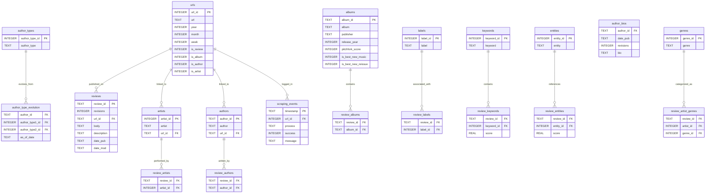

# 🎵 pitchfork-2025

*A blazing-fast, multithreaded scraper for Pitchfork's album reviews, inspired by [Nolan Conaway's](https://github.com/nolanbconaway) work from [2022](https://github.com/nolanbconaway/pitchfork-2022) and [2018](https://github.com/nolanbconaway/pitchfork-data).*

## 🚀 Key Features
- **📊 Ready-to-Use SQL Views** for easy analysis & visualization
- **⚡ 63 minutes** to scrape **Pitchfork's sitemap + album reviews + author bios**  
  *(Benchmarked on a 24-thread CPU with a 200 Mbps internet connection)*
- **🔗 SQLite Database with 5NF Normalization** *(except for `author_type_evolution` in 4NF)*
- **📂 Modular & Extendable** – Well-organized code for future improvements
- **💡 Multithreaded Performance** – Scrapes multiple pages simultaneously
- **🔍 JSON-based Parsing**

---

## 🛠️ How It Works
### 🔗 URL Mapping
1. Scrapes **Pitchfork's sitemap** to extract the following types of URLs:
   - 📰 News (*'/news/'*)
   - 🏆 Live Grammy coverage (*'/grammys/'*)
   - 🎵 Album reviews (*'/reviews/albums/'*)
   - 🎧 Track reviews (*'/reviews/tracks/'*)
   - 🎬 Movie reviews (*'/thepitch/'*)
   - ✍️ Features (*'/features/'*)
   - 🎥 Videos (*'/tv/'*)
   
2. Scrapes **album review pages** to extract:
   - 🎤 *Artists* (Links to their dedicated pages)
   - ✍️ *Authors* (Links to their bio pages)

3. Scrapes **author pages** for **detailed author metadata**.

---

## ⚙️ Scraping & Parsing

This script uses **BeautifulSoup** & **JSON parsing** allowing to:
* ❌ avoid unicode characters 
* 🕵️ reveal ***hidden* data structures**.
* 📒 Apply **data normalization techniques** to ensure minimal redundancy.

### **🎵 Album Data Extraction
- Avoids messy **Unicode character cleaning** by **extracting structured JSON data**.
- Navigates **deeply nested JSON structures** to retrieve key data fields.

### ✍️ Author Data Extraction
- Retrieves **author roles & biography**.

---

## 📦 Database & Storage
- **🔗 SQLite database** stores all scraped data.
- **⚡ Optimized with indexes & foreign keys** for fast queries.
- **📊 SQL Views** allow users to start analyzing data **without writing complex SQL**.

### **📂 Database Schema


---

## 🏗️ Project Structure
📂 **pitchfork-2025/**  
├── 📁 **scraper/** # Core scraping & data parsing logic  
│ ├── **init.py**  
│ ├── **album.py**  # Scrapes album reviews  
│ ├── **author.py** # Scrapes author bios & roles  
│ ├── **db.py** # Handles SQLite database interactions  
│ ├── **general.py** # Helper functions & utilities  
│ ├── **globals.py** # Global variables for multithreading  
│ ├── **sitemap.py** # Handles sitemap extraction  
│ ├── **types.py** # Custom data types & NamedTuples to communicate with the database  
│ └── **README.md** # Documentation for the scraper  
│ ├── 📄 **Scrape_Pitchfork.py** # Main script to execute scraping  
├── 📂 **data/** # Stores scraped SQLite database  
├── 📂 **sql_scripts/**  
| ├── ...# SQL script to create the database **indexes**, **views** and **metadata** 
└── 📄 README.md # Project documentation (this file) 

---

## 🚀 Getting Started
### 🔧 Installation
1. **Clone the repository**
```bash
git clone https://github.com/DiegoRioboCabot/pitchfork-2025.git
cd pitchfork-2025
```
2. Install dependencies
```bash 
pip install -r requirements.txt
```

### 🔥 Running the Scraper
Just run the following code on a terminal:  
```bash 
python Scrape_Pitchfork.py
```

### 💾 SQLite Database
After running the script, your data will be in stored inside ```data/``` 
and the filename is ```Pithfrok_Album_Reviews_yyyy_mm_dd.db``` where  
* *yyyy* represent the year in which the script started, 
* *mm* the month and 
* *dd* the day.

## 📝 Contributing
Feel free to fork the repo and submit improvements.

## 📜 License
This project is licensed under the *GNU 3 General Public* License.